# Labmobile8_DanielAbdillahArif_ShiftC

# Penjelasan Proses CRUD

1. Menampilkan Data (Read)

Proses ini bertujuan untuk menampilkan data mahasiswa dari database.

- file tampil.php

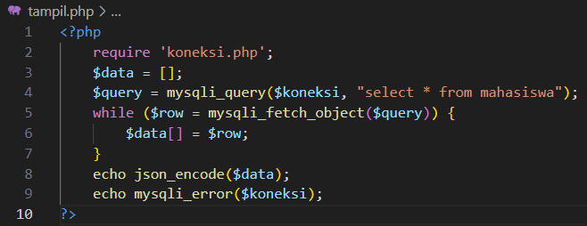

- file api.service.ts

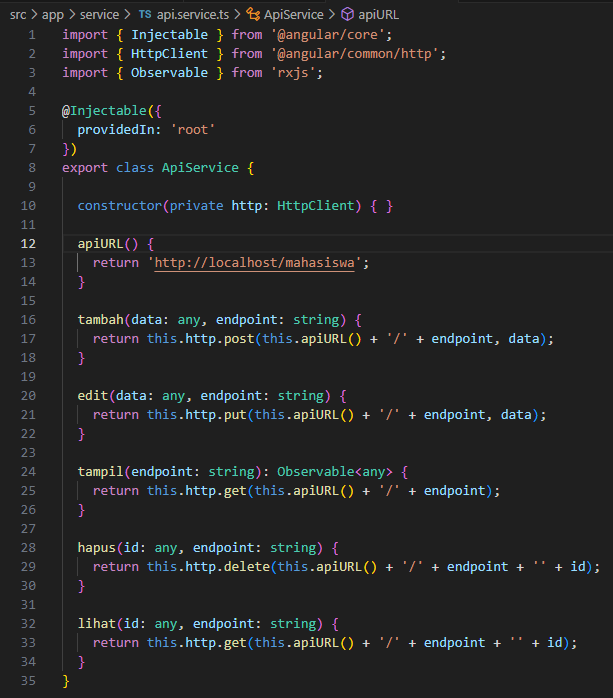

- file mahasiswa.page.ts (fungsi getMahasiswa)

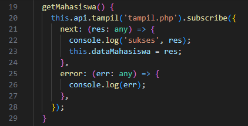

- file mahasiswa.page.html (Tampil List Item)

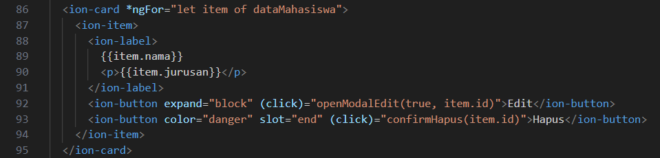

Proses ini dimulai dari tampil.php pada backend. File ini memuat semua data dari tabel mahasiswa menggunakan query SELECT * FROM mahasiswa dan kemudian mengonversinya menjadi format JSON agar dapat dikonsumsi oleh frontend. Di sisi frontend, pada file api.service.ts, terdapat fungsi tampil(endpoint: string) yang mengirim permintaan HTTP GET ke backend. Fungsi ini digunakan oleh mahasiswa.page.ts melalui metode getMahasiswa(), yang dipanggil saat halaman dimuat (di dalam ngOnInit()). Setelah mendapatkan respons dari server, data mahasiswa disimpan dalam variabel dataMahasiswa, yang kemudian digunakan pada mahasiswa.page.html untuk menampilkan daftar mahasiswa secara dinamis menggunakan direktif Angular *ngFor.

2. Menambah Data (Create)

Proses ini menambah data mahasiswa baru ke dalam database.

- file tambah.php

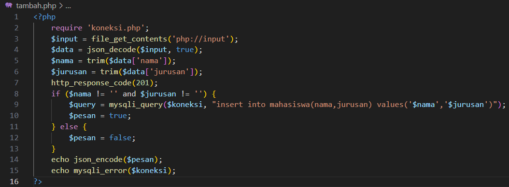

- file api.service.ts

- file mahasiswa.page.ts (fungsi tambahMahasiswa + modalTambah)

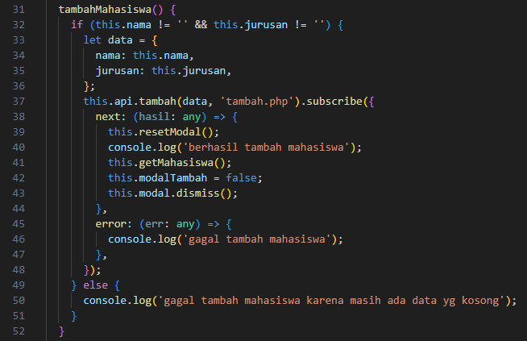

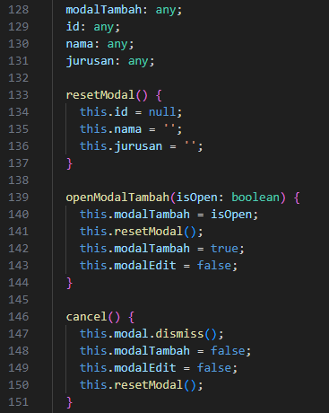

- file mahasiswa.page.html (tombol tambah + modal tambah)

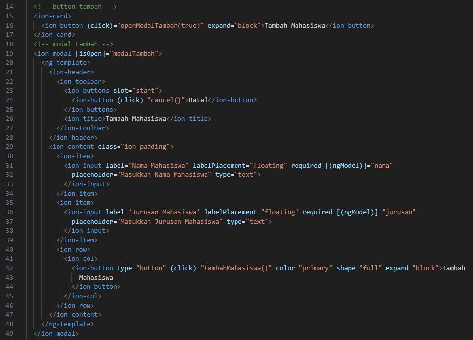

Pada proses menambah data, tambah.php menerima data mahasiswa dalam format JSON melalui php://input yang dibaca dan dikonversi menjadi array PHP. Nama dan jurusan mahasiswa kemudian diambil dari data tersebut, dan jika keduanya tidak kosong, dilakukan query INSERT ke tabel mahasiswa untuk menyimpan data baru ini. Kode kemudian merespons dengan nilai true jika operasi berhasil dan false jika gagal. Di sisi frontend, fungsi tambah(data: any, endpoint: string) pada api.service.ts mengirim permintaan POST ke tambah.php. Fungsi ini digunakan oleh tambahMahasiswa() di mahasiswa.page.ts, yang pertama-tama mengambil nilai dari input pengguna dan mengirimkannya ke backend. Jika respons dari server menyatakan bahwa data berhasil ditambahkan, modal input akan ditutup, dan daftar data mahasiswa diperbarui dengan memanggil getMahasiswa().

3. Mengedit Data (Update)

Proses ini memperbarui data mahasiswa yang ada di database.

- file edit.php

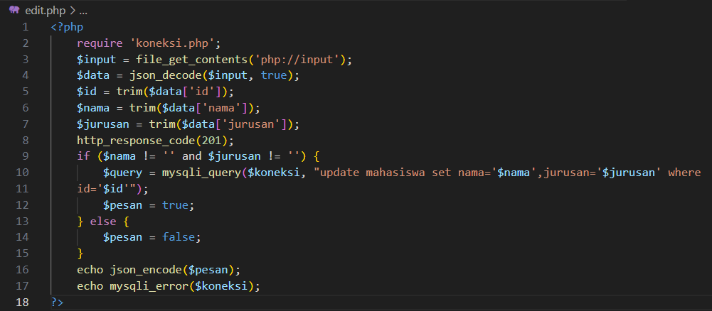

- file lihat.php

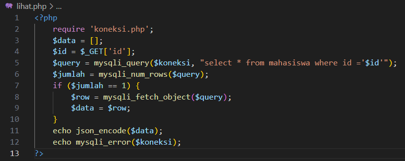

- file api.service.ts

- file mahasiswa.page.ts (fungsi ambilMahasiswa + editMahasiswa + modalEdit)

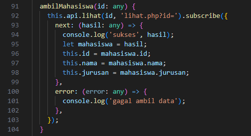

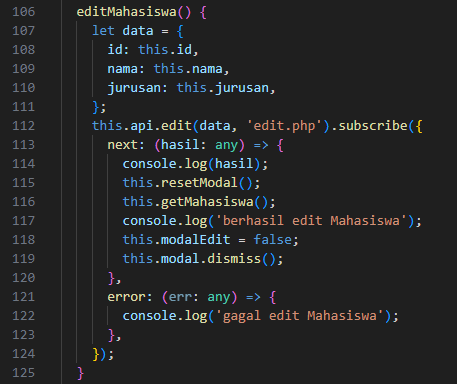

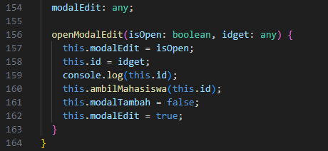

- file mahasiswa.page.html (modal edit)

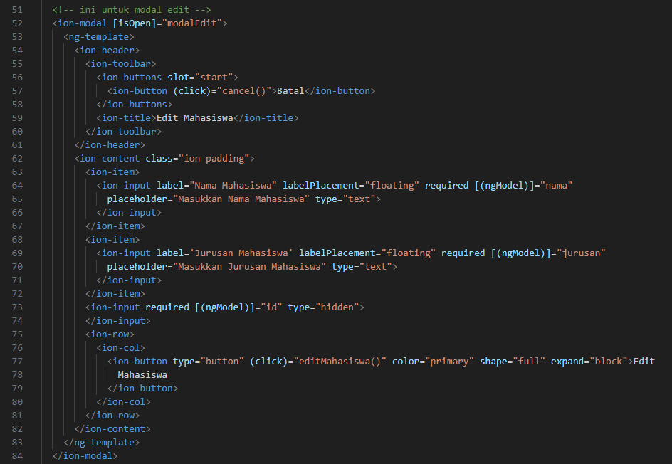

Pada proses pengeditan data, edit.php di backend menerima data ID, nama, dan jurusan mahasiswa yang ingin diperbarui. Data ini diterima dalam format JSON, dibaca dengan php://input, dan dikonversi menjadi array PHP. Kemudian dilakukan query UPDATE yang menyesuaikan data sesuai ID mahasiswa yang diberikan. Jika operasi berhasil, server merespons dengan true, dan false jika gagal. Di sisi frontend, fungsi edit(data: any, endpoint: string) pada api.service.ts mengirim permintaan PUT ke edit.php. Fungsi ini dipanggil oleh editMahasiswa() di mahasiswa.page.ts, yang pertama-tama mengumpulkan data dari pengguna (ID, nama, dan jurusan), lalu mengirimkannya ke server. Setelah berhasil diperbarui, modal akan ditutup, dan daftar data mahasiswa kembali diperbarui dengan memanggil getMahasiswa().

4. Menghapus Data (Delete)

Proses ini menghapus data mahasiswa dari database.

- file hapus.php

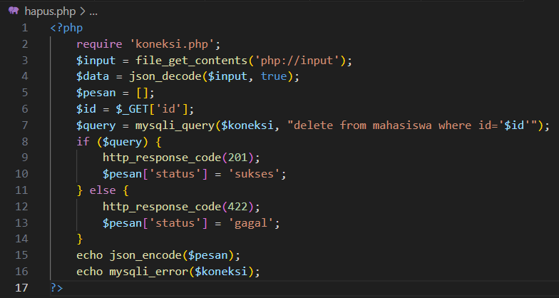

- file api.service.ts

- file mahasiswa.page.ts (fungsi hapusMahasiswa + confirmHapus)

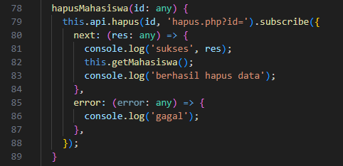

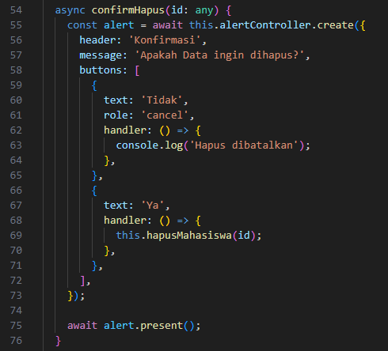

Proses penghapusan data dimulai dari hapus.php di backend, yang menerima ID mahasiswa yang akan dihapus melalui parameter $_GET. Query DELETE dijalankan berdasarkan ID yang diberikan. Jika penghapusan berhasil, server merespons dengan status sukses, jika gagal, statusnya gagal. Di frontend, fungsi hapus(id: any, endpoint: string) pada api.service.ts mengirim permintaan DELETE ke hapus.php. Fungsi ini dipanggil oleh hapusMahasiswa(id: any) di mahasiswa.page.ts, yang mengirimkan ID mahasiswa yang akan dihapus ke backend. Setelah penghapusan berhasil, data terbaru dari daftar mahasiswa ditampilkan kembali dengan memanggil getMahasiswa().

# SS Tampilan Aplikasi

- Halaman View Kosong

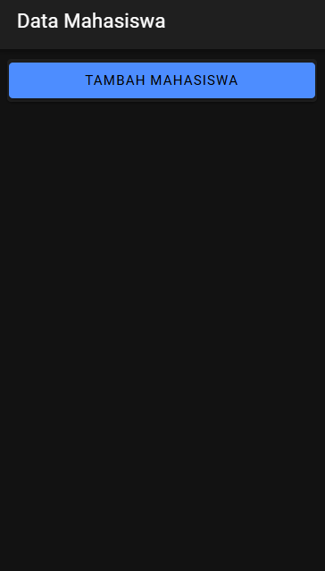

- Modal Tambah Data Awal

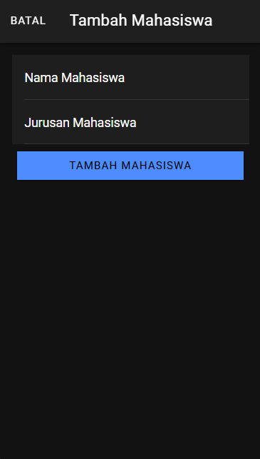

- Modal Tambah Data Isi

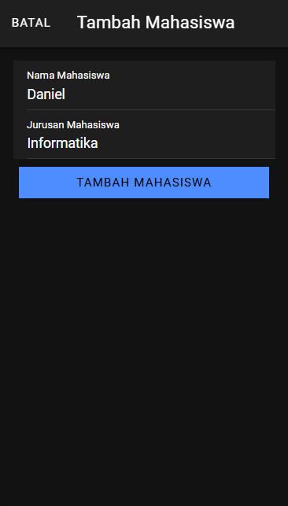

- Halaman View setelah Proses Tambah Data

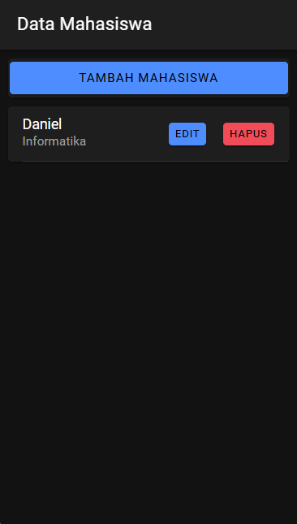

- Modal Edit Data Awal

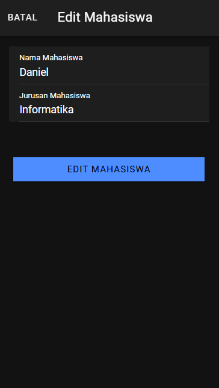

- Modal Edit Data Diganti

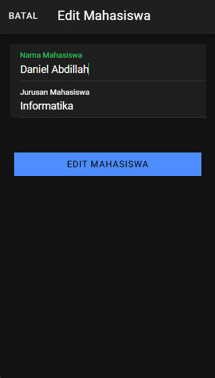

- Halaman View setelah Proses Edit Data

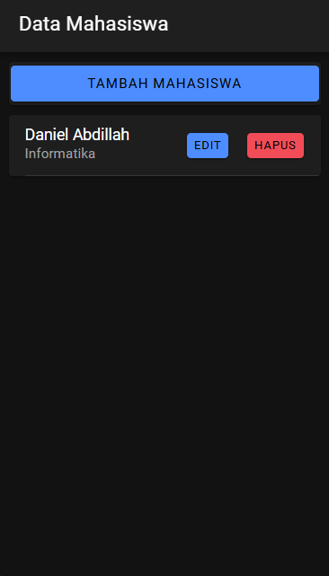

- Alert Hapus Data

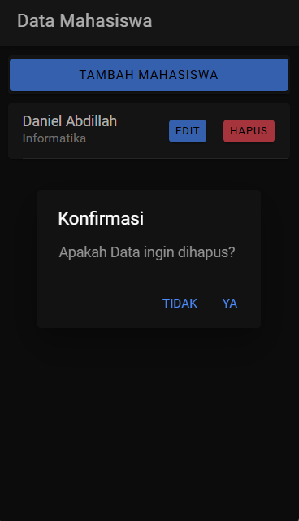